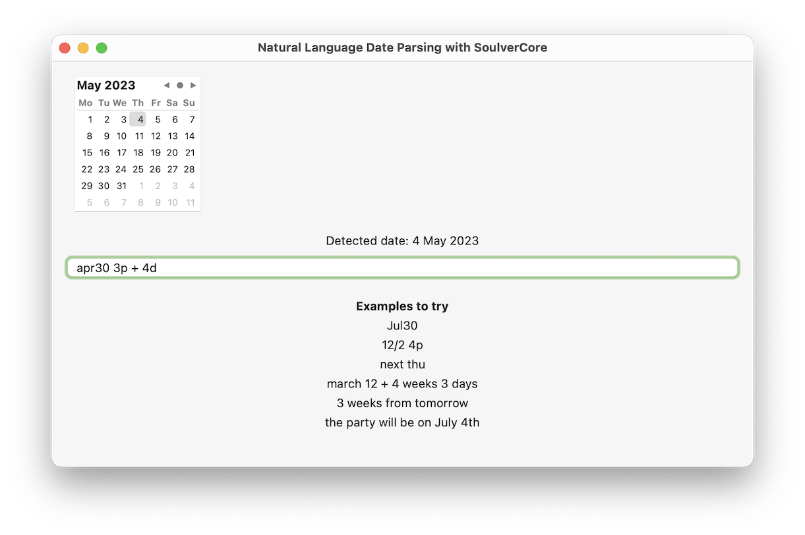

## Natural Language Date Parsing (with SoulverCore)

[SoulverCore](https://soulver.app/core)'s flexible & powerful date parser can be used to add a natural language date scheduling feature to your Mac or iOS calendar or reminders app. 

Natural language date input features can be found in apps like [Things](https://culturedcode.com/things/support/articles/9780167/), [Fantastical](https://flexibits.com/fantastical-ios/help/adding) and [Raycast](https://www.raycast.com/extensions/reminders) and make the user experience better.

## Usage

The SoulverCore framework adds a single property `dateValue` to `String`:

```swift
public extension String {
   var dateValue: Date?
}
```

Use this property to extract the last natural language date found in the string. The `dateValue` will be `nil` if there are no dates in the string.

## Installation

You can add SoulverCore to your project via the Swift Package Manager.

See the main [SoulverCore](https://soulver.app/core) repository for installation instructions.

## Requirements

- Xcode 14+
- Swift 5.7+

## SoulverCore vs Foundation's DataDetector

Apple's Foundation framework includes NSDataDetector for detecting dates in strings. 

Here is an example:

```swift
let expression = "March 5th, 2023"
let types: NSTextCheckingResult.CheckingType = [.date ]
let detector = try! NSDataDetector(types: types.rawValue)
let match = detector.matches(in: expression, options: .init(rawValue: 0), range: NSRange(location: 0, length: expression.count)).first
let date = match?.date
```

Compare this to SoulverCore:

```swift
let date = "March 5th, 2023".dateValue
```

In addition to a much nicer API, SoulverCore also adds a number of additional features not supported by NSDataDetector.

## Supported Features

#### Natural language calendar math

Use natural language phrases like `3 weeks from tomorrow` and `march 12 + 4 weeks 3 days`.

SoulverCore supports a large range of different natural language date syntaxes. See the [Soulver Documentation](https://documentation.soulver.app/syntax-reference/dates-and-times) for more examples.

#### Units & unit shorthands

SoulverCore interprets units of time as referring to a future date after the specified amount of time has passed.

For example `2 weeks 2 days` will be interpreted as `2 weeks and 2 days` __from now__.

The following time unit shorthands are also supported:

- "1y" (1 year)
- "5mo" (5 months)
- "3w" (3 weeks)
- "2d" (2 days)

Shorthands can be combined together:

- "12-9 9p" means the "12th of September at 9pm" (in a non-US locale)

#### Half-formed dates

Examples:

- "3/12" (Dec 3, or March 12 in the US)
- "12.2" (Feb 12 or Dec 2 in the US)
- "9-5" (May 9 or Sep 5 in the US)

#### Day & month shorthands

Examples:

- "Next mon" (next monday)
- "tod" (today)
- "apr3" (April 3)
- "yes" (yesterday)
- "tom" (tomorrow)

#### AM/PM shorthands

Examples:

- "3p" (3pm)
- "5a" (5am)

#### Random words ignored 

SoulverCore extracts the last date present in the given string, and ignores random words before and after it. 

For example, the following are valid inputs:

- "Tom's birthday party __this sunday__"
- "Schedule the meeting for __April 21st next year__"
- "__June 5__ the kids get off school"

## Sample Project

This repository includes a sample example SwiftUI app that shows how to build a natural language date input feature using SoulverCore:
º


## Detailed information about the parsed date

SoulverCore's `DatestampType` enum contains detailed information about the kind of date detected and what date components were explicitly specified.

See the example project `func getDatestampType()` for how to access this type information.

## Performance

SoulverCore is very efficient and can perform thousands of date-from-string extractions every second.

## Localizations

In addition to English, SoulverCore is localized into German, French, Spanish, Russian & Simplified Chinese. 

The user's system locale will be used for date parsing, and date & time formats specific the particular region are taken into account.

## Licence

SoulverCore is a commercially licensable, **closed-source** Swift framework. The standard licensing terms of SoulverCore do apply for its use in natural language date parsing (see [SoulverCore Licence](https://github.com/soulverteam/SoulverCore#licence)).

For personal (non-commercial) projects, you do not need a license. So go ahead and use this great library in your personal projects!

There are also attribution-only licences available for a few commercial use cases.
